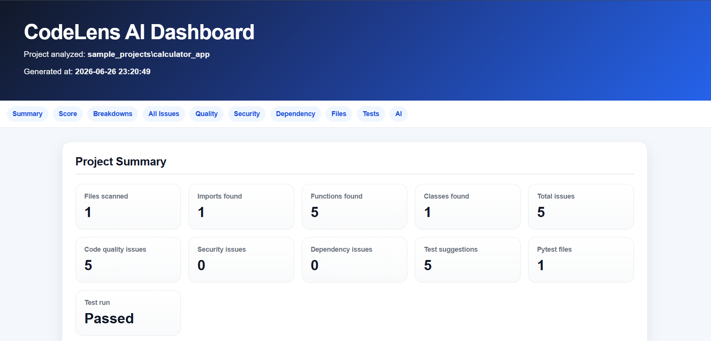
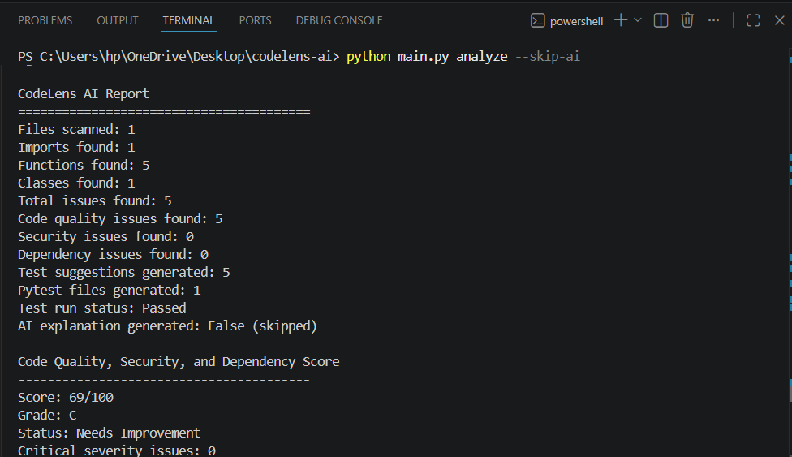
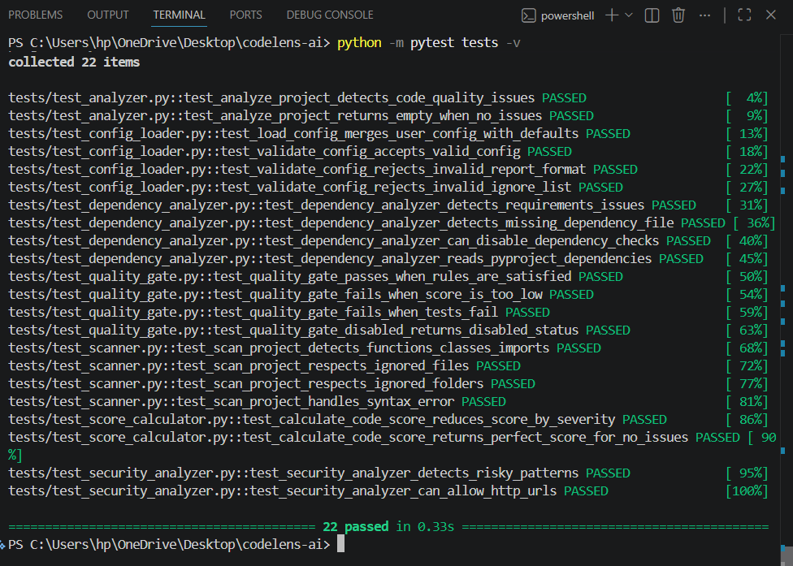
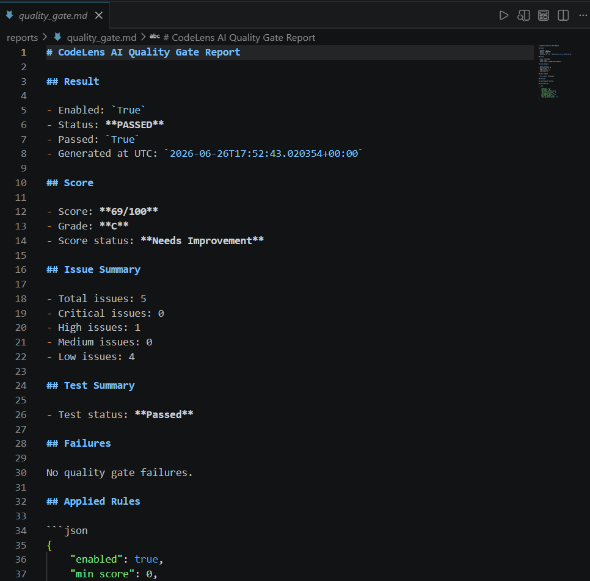
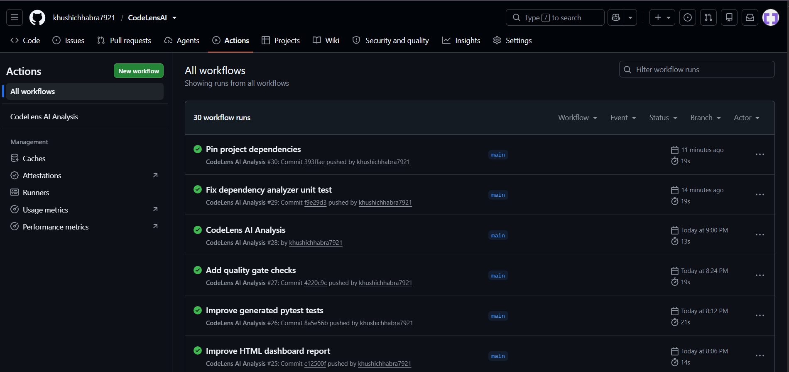

# CodeLens AI

CodeLens AI is a Python-based code analysis, security review, dependency review, testing, reporting, and CI automation tool.

It scans a Python project, identifies code quality issues, detects security risks, checks dependency hygiene, generates pytest tests, calculates a score, tracks trends over time, creates reports, and can automatically comment on GitHub pull requests.

In simple terms:

> CodeLens AI is a lightweight AI-assisted code review tool for Python projects.

---
## Screenshots

### HTML Dashboard Report

The HTML dashboard gives a visual summary of project health, including score, issue breakdowns, test results, and detailed file analysis.



---

### Terminal Analysis Output

CodeLens AI prints a full terminal summary including runtime options, scanned files, issue counts, score, trends, quality gate result, and generated reports.



---

### Unit Tests

The project includes unit tests for core CodeLens AI modules such as scanner, analyzer, security analyzer, dependency analyzer, score calculator, quality gate, and config loader.



---

### Quality Gate Report

The quality gate checks whether the project passes configured CI/CD quality rules such as minimum score, maximum critical issues, and test result status.



---

### GitHub Actions Workflow

CodeLens AI runs automatically in GitHub Actions on push, pull request, or manual workflow trigger.



---
## Features

### Python Code Scanner

CodeLens AI scans Python files and extracts:

- Imports
- Functions
- Classes
- Function arguments
- Line numbers
- Function line count
- Class line count
- Docstring availability
- Division operation usage
- Async function detection
- Class method detection

The scanner uses Python's AST module, so it analyzes code structure instead of only searching text.

---

### Code Quality Analyzer

CodeLens AI detects basic code quality issues such as:

- Missing function docstrings
- Missing class docstrings
- Long functions
- Too many function arguments
- Possible division-related runtime risks

These rules can be configured from `codelens.yml`.

---

### Security Analyzer

CodeLens AI detects risky Python patterns such as:

- `eval()`
- `exec()`
- `os.system()`
- `subprocess` with `shell=True`
- `pickle.load()`
- `pickle.loads()`
- Unsafe `yaml.load()`
- Hardcoded secrets
- Insecure `http://` URLs

This helps identify common security problems during development.

---

### Dependency Analyzer

CodeLens AI checks dependency files for dependency hygiene issues.

Supported files include:

- `requirements.txt`
- `requirements-dev.txt`
- `dev-requirements.txt`
- `requirements/*.txt`
- `pyproject.toml`
- `Pipfile`

It can detect:

- Missing dependency files
- Empty dependency files
- Unpinned dependencies
- Loose version constraints
- Wildcard dependency versions
- Unsafe HTTP dependency URLs
- Editable installs
- Direct URL dependencies
- Local path dependencies
- Invalid TOML dependency files
- Unsupported dependency formats

Example issue:

```text
pytest
```

This is considered unpinned.

Preferred format:

```text
pytest==8.4.1
```

---

### Ignore / Exclude Patterns

CodeLens AI supports ignore patterns through `codelens.yml`.

By default, it skips folders such as:

```text
.git
.venv
venv
__pycache__
.pytest_cache
.mypy_cache
generated_tests
reports
node_modules
dist
build
```

This keeps scans clean and prevents generated files or environment folders from being analyzed.

---

### Score Calculator

CodeLens AI calculates a score from `0` to `100`.

The score starts at `100` and decreases based on issue severity:

```text
Critical: -20
High:     -15
Medium:   -8
Low:      -4
```

It also assigns a grade:

```text
A: Excellent
B: Good
C: Needs Improvement
D: Poor
F: Critical
```

---

### Score History Tracking

CodeLens AI tracks score history across multiple runs.

It generates:

```text
reports/score_history.json
reports/score_history.md
```

The history tracker shows whether the project score has:

- Improved
- Declined
- Stayed unchanged
- Been tracked for the first time

---

### Issue Trend Tracking

CodeLens AI tracks issue changes across multiple runs.

It generates:

```text
reports/issue_trends.json
reports/issue_trends.md
```

It compares the current run with the previous run and shows:

- Added issues
- Resolved issues
- Unchanged issues
- Issue count change
- Category breakdown
- Severity breakdown
- Recent runs

---

### Test Suggestion Generator

CodeLens AI generates test suggestions for every discovered function.

Suggestions include:

- Function existence tests
- Callable checks
- Normal input tests
- Edge case tests
- Invalid input tests
- Arithmetic-specific tests
- Division-by-zero behavior tests
- Class method setup suggestions

---

### Improved Pytest Generator

CodeLens AI can automatically generate pytest files inside:

```text
generated_tests/
```

It creates safer tests such as:

- Import tests
- Function existence tests
- Callable tests
- Addition tests
- Subtraction tests
- Multiplication tests
- Division tests
- Square / cube / power tests
- String reverse tests
- Even / odd tests

Old generated tests are automatically cleaned before new ones are created.

---

### Automatic Pytest Runner

CodeLens AI can run the generated pytest files automatically.

The pytest result is included in:

- Terminal output
- Markdown report
- JSON report
- HTML report
- PR comment
- Quality gate report

---

### AI Codebase Explanation

CodeLens AI can generate an AI explanation of the analyzed codebase using Groq.

AI explanation can be skipped using:

```bash
python main.py analyze --skip-ai
```

or through config:

```yaml
analysis:
  skip_ai: true
```

By default, the project config skips AI to make local and CI runs faster and easier.

---

### Markdown Report

CodeLens AI generates:

```text
reports/codelens_report.md
```

The Markdown report includes:

- Project summary
- Score
- Detailed file analysis
- Code quality issues
- Security issues
- Dependency issues
- Test suggestions
- Generated pytest files
- Pytest result
- AI explanation

---

### JSON Report

CodeLens AI generates:

```text
reports/codelens_report.json
```

The JSON report is useful for:

- Automation
- CI/CD
- Programmatic analysis
- Integrating with other tools

---

### HTML Dashboard Report

CodeLens AI generates:

```text
reports/codelens_report.html
```

The HTML dashboard includes:

- Summary cards
- Score panel
- Severity breakdown
- Category breakdown
- Issue type breakdown
- All issues table
- Code quality section
- Security section
- Dependency section
- File analysis section
- Test section
- AI explanation section

Open it in a browser to view the dashboard.

---

### Pull Request Comment Generation

CodeLens AI generates:

```text
reports/pr_comment.md
```

In GitHub Actions, this file is used to automatically comment a summary on pull requests.

The PR comment includes:

- Score
- Grade
- Status
- Test status
- Score trend
- Issue trend
- Project summary
- Issue summary
- Top code quality issues
- Top security issues
- Top dependency issues
- Generated report paths

---

### Quality Gate

CodeLens AI supports quality gate rules through `codelens.yml`.

It generates:

```text
reports/quality_gate.json
reports/quality_gate.md
```

Quality gate checks can include:

- Minimum score
- Maximum total issues
- Maximum critical issues
- Maximum high issues
- Maximum medium issues
- Maximum low issues
- Whether failed generated tests should fail the gate

Example:

```yaml
quality_gate:
  enabled: true
  min_score: 70
  max_critical_issues: 0
  max_high_issues: 5
  fail_on_tests_failed: true
```

If the quality gate fails, CodeLens AI exits with a non-zero status code. This allows GitHub Actions to fail the workflow when quality rules are not met.

---

### CLI Support

CodeLens AI supports flexible command-line options.

Examples:

```bash
python main.py analyze
python main.py analyze sample_projects/calculator_app
python main.py analyze sample_projects/vulnerable_app
python main.py analyze --format html
python main.py analyze --format json
python main.py analyze --format markdown
python main.py analyze --skip-ai
python main.py analyze --use-ai
python main.py analyze --skip-tests
python main.py analyze --run-tests
python main.py analyze --no-history
python main.py analyze --track-history
python main.py analyze --no-issue-trends
python main.py analyze --track-issue-trends
python main.py analyze --no-pr-comment
python main.py analyze --generate-pr-comment
python main.py analyze --no-quality-gate
python main.py analyze --quality-gate
python main.py analyze --output-dir custom_reports
python main.py analyze --config codelens.yml
```

---

### Config File Support

CodeLens AI supports a root-level config file:

```text
codelens.yml
```

This lets users control default project path, report format, output directory, analysis options, rules, ignore patterns, dependency patterns, PR comment generation, and quality gate behavior.

---

### GitHub Actions Workflow

CodeLens AI includes a GitHub Actions workflow that runs on:

- Push to `main`
- Pull request to `main`
- Manual workflow trigger

The workflow:

- Installs Python dependencies
- Runs CodeLens AI
- Runs generated pytest tests
- Posts PR comments on pull requests
- Uploads reports as workflow artifacts

Generated artifacts include:

```text
reports/codelens_report.md
reports/codelens_report.json
reports/codelens_report.html
reports/score_history.json
reports/score_history.md
reports/issue_trends.json
reports/issue_trends.md
reports/quality_gate.json
reports/quality_gate.md
reports/pr_comment.md
```

---

## Project Structure

```text
CODELENS-AI/
│
├── .github/
│   └── workflows/
│       └── codelens.yml
│
├── codelens/
│   ├── ai_explainer.py
│   ├── analyzer.py
│   ├── config_loader.py
│   ├── dependency_analyzer.py
│   ├── history_tracker.py
│   ├── html_reporter.py
│   ├── issue_trend_tracker.py
│   ├── json_reporter.py
│   ├── pr_commenter.py
│   ├── quality_gate.py
│   ├── reporter.py
│   ├── scanner.py
│   ├── score_calculator.py
│   ├── security_analyzer.py
│   ├── test_generator.py
│   ├── test_runner.py
│   └── test_writer.py
│
├── sample_projects/
│   ├── calculator_app/
│   │   └── calculator.py
│   │
│   └── vulnerable_app/
│       └── vulnerable.py
│
├── generated_tests/
│   └── generated pytest files
│
├── reports/
│   └── generated reports
│
├── codelens.yml
├── main.py
├── requirements.txt
├── README.md
└── DEMO_GUIDE.md
```

---

## Installation

Clone the repository:

```bash
git clone https://github.com/khushichhabra7921/CodeLensAI.git
cd CodeLensAI
```

Create a virtual environment:

```bash
python -m venv venv
```

Activate it on Windows PowerShell:

```bash
venv\Scripts\Activate.ps1
```

If PowerShell blocks script execution, use:

```bash
Set-ExecutionPolicy -ExecutionPolicy RemoteSigned -Scope CurrentUser
```

Then activate again:

```bash
venv\Scripts\Activate.ps1
```

Install dependencies:

```bash
python -m pip install --upgrade pip
python -m pip install -r requirements.txt
```

---

## Optional AI Setup

Create a `.env` file in the root folder:

```text
GROQ_API_KEY=your_api_key_here
GROQ_MODEL=llama-3.3-70b-versatile
```

If you do not want to use AI explanation, keep this in `codelens.yml`:

```yaml
analysis:
  skip_ai: true
```

or run:

```bash
python main.py analyze --skip-ai
```

---

## Basic Usage

Run the default analysis:

```bash
python main.py analyze
```

This uses the default project path from `codelens.yml`:

```yaml
project:
  default_path: sample_projects/calculator_app
```

Analyze a specific project:

```bash
python main.py analyze sample_projects/calculator_app
```

Analyze the vulnerable sample project:

```bash
python main.py analyze sample_projects/vulnerable_app
```

Generate only HTML report:

```bash
python main.py analyze --format html
```

Generate all reports:

```bash
python main.py analyze --format all
```

Skip AI:

```bash
python main.py analyze --skip-ai
```

Skip tests:

```bash
python main.py analyze --skip-tests
```

Disable quality gate for a run:

```bash
python main.py analyze --no-quality-gate
```

Use custom output directory:

```bash
python main.py analyze --output-dir custom_reports
```

---

## Configuration

Default `codelens.yml`:

```yaml
project:
  default_path: sample_projects/calculator_app

reports:
  format: all
  output_dir: reports
  generate_pr_comment: true

analysis:
  skip_ai: true
  skip_tests: false
  track_history: true
  track_issue_trends: true

quality_gate:
  enabled: true
  min_score: 0
  max_total_issues: null
  max_critical_issues: 0
  max_high_issues: 10
  max_medium_issues: null
  max_low_issues: null
  fail_on_tests_failed: true

rules:
  max_function_lines: 30
  max_arguments: 5
  check_security: true
  allow_http_urls: false
  check_dependencies: true
  dependency_file_patterns:
    - requirements.txt
    - requirements-dev.txt
    - dev-requirements.txt
    - requirements/*.txt
    - pyproject.toml
    - Pipfile
  require_pinned_dependencies: true
  allow_editable_installs: false
  allow_http_dependencies: false

ignore:
  folders:
    - .git
    - .venv
    - venv
    - __pycache__
    - .pytest_cache
    - .mypy_cache
    - generated_tests
    - reports
    - node_modules
    - dist
    - build

  files: []
```

---

## Generated Reports

After running:

```bash
python main.py analyze
```

CodeLens AI can generate:

```text
reports/codelens_report.md
reports/codelens_report.json
reports/codelens_report.html
reports/score_history.json
reports/score_history.md
reports/issue_trends.json
reports/issue_trends.md
reports/quality_gate.json
reports/quality_gate.md
reports/pr_comment.md
```

Open the HTML report:

```bash
start reports/codelens_report.html
```

Open Markdown reports in VS Code:

```bash
code reports/codelens_report.md
code reports/score_history.md
code reports/issue_trends.md
code reports/quality_gate.md
code reports/pr_comment.md
```

---

## Sample Projects

### Calculator App

Path:

```text
sample_projects/calculator_app
```

Use:

```bash
python main.py analyze sample_projects/calculator_app
```

This project is useful for demonstrating:

- Code scanning
- Function detection
- Test suggestion generation
- Pytest generation
- Reports
- Score calculation

---

### Vulnerable App

Path:

```text
sample_projects/vulnerable_app
```

Use:

```bash
python main.py analyze sample_projects/vulnerable_app
```

This project is useful for demonstrating:

- Security issue detection
- Dangerous function usage
- Hardcoded secret detection
- Insecure URL detection
- Score reduction based on severity

---

## GitHub Actions

The workflow file is located at:

```text
.github/workflows/codelens.yml
```

It runs automatically on:

```text
push to main
pull_request to main
manual workflow_dispatch
```

The workflow uploads reports as artifacts.

On pull requests, it can also post a CodeLens AI summary comment using:

```text
reports/pr_comment.md
```

---

## Quality Gate Behavior in CI

When quality gate is enabled, CodeLens AI exits with code `1` if the quality gate fails.

This means GitHub Actions can fail automatically when the project does not meet quality standards.

For early development, the default config uses:

```yaml
quality_gate:
  min_score: 0
```

This keeps the workflow from failing too aggressively while the tool is being built.

For stricter production-like behavior, use:

```yaml
quality_gate:
  enabled: true
  min_score: 70
  max_critical_issues: 0
  max_high_issues: 5
  fail_on_tests_failed: true
```

---

## Recommended Demo Command

For a clean demo, run:

```bash
python main.py analyze sample_projects/calculator_app --format all --skip-ai
```

Then open:

```bash
start reports/codelens_report.html
```

For security demo:

```bash
python main.py analyze sample_projects/vulnerable_app --format all --skip-ai --skip-tests --no-quality-gate
```

---

## Future Improvements

Possible future improvements:

- Real dependency vulnerability scanning using `pip-audit`, Safety, or OSV
- Support for more languages such as JavaScript, TypeScript, and Java
- Better AI-based test generation using function source code
- Code complexity metrics
- Duplicate code detection
- Full web dashboard
- SARIF output for GitHub code scanning
- Inline pull request review comments
- Package publishing as a CLI tool

---

## Summary

CodeLens AI is a complete Python code review automation tool with:

- Static code analysis
- Security checks
- Dependency checks
- Test generation
- Pytest execution
- AI explanation
- Reports
- Score tracking
- Issue trend tracking
- PR comments
- Quality gate enforcement
- GitHub Actions integration

It can be used locally or in CI/CD to understand and improve Python project quality.